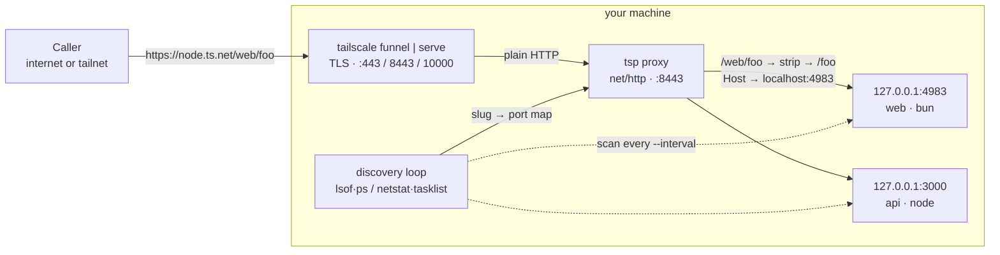
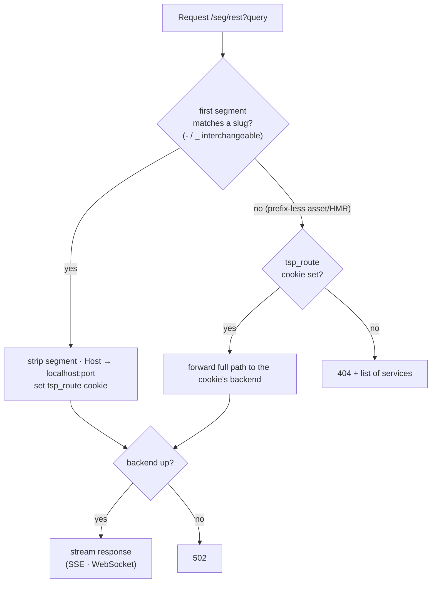

# tailscale-proxy (`tsp`)

[](https://github.com/meabed/tailscale-proxy/actions/workflows/ci.yml)
[](https://github.com/meabed/tailscale-proxy/actions/workflows/release.yml)
[](https://www.npmjs.com/package/tailscale-proxy)
[](https://tailscaleproxy.vercel.app)

Self-hosted **[ngrok](https://ngrok.com) alternative** on [Tailscale](https://tailscale.com) —
share all your local dev servers through one stable `*.ts.net` URL, routed by project name.

## ⬇️ Download the desktop app

A native **menu-bar app** — start/stop the proxy, watch your dev servers, and share
them, no terminal needed. <a href="https://tailscaleproxy.vercel.app/desktop"></a>

| Platform | Direct download |
| --- | --- |
| 🍎 **macOS** · Apple Silicon & Intel | **[Tailscale-Proxy-macOS.dmg](https://github.com/meabed/tailscale-proxy/releases/download/desktop-latest/Tailscale-Proxy-macOS.dmg)** |
| 🪟 **Windows** · 64-bit | **[Tailscale-Proxy-Windows.zip](https://github.com/meabed/tailscale-proxy/releases/download/desktop-latest/Tailscale-Proxy-Windows.zip)** |
| 🐧 **Linux** · 64-bit | **[Tailscale-Proxy-Linux.tar.gz](https://github.com/meabed/tailscale-proxy/releases/download/desktop-latest/Tailscale-Proxy-Linux.tar.gz)** |

→ [All releases](https://github.com/meabed/tailscale-proxy/releases) · [setup, screenshots & docs](https://tailscaleproxy.vercel.app/desktop)

## ⚡ Or one command in the terminal

```bash
npx tailscale-proxy                   # discovers your dev servers + shares them via Tailscale
brew install meabed/tap/tsp && tsp    # or install the binary
```

First time? `npx tailscale-proxy doctor` checks your setup — see [Requirements](#requirements).

---

An open-source, **self-hosted [ngrok](https://ngrok.com) alternative** built on
[Tailscale](https://tailscale.com). Discover your local dev servers by **port**,
and expose them through a **single Tailscale entry** — privately (Serve,
tailnet-only) or publicly (Funnel) — routed by **project name**.

> **vs. ngrok:** your own stable `*.ts.net` URL over your Tailscale tunnel — no
> third-party relay, no random per-session URLs, no rate limits/paywalls. One
> hostname for **many** dev servers, discovered automatically (no `ngrok http 3000`
> per port).

No per-app wiring: just run your servers (`node`, `bun`, `deno`, `python`, `php`, `ruby`, `go`, `java`, …) and `tsp` finds the ones listening in a port range, derives a path slug
from each project's folder, and routes to them under one hostname:

```
https://<node>.ts.net/<project>/foo
                      └────┬────┘
   tsp strips the segment, forwards → 127.0.0.1:<port>/foo
```

It re-scans every few seconds (so servers that come and go are picked up), keeps a
service around for a few scans before de-registering (no flapping on restarts), and
streams SSE / proxies WebSocket upgrades. Zero runtime dependencies — one small Go
binary.

The path slug is **separator-insensitive** by default: a project routed as
`/module-api/` is equally reachable at `/module_api/`, so you never have to remember
whether a name used dashes or underscores (turn off with `--match-separators=false`).

---

## Quick start

```bash
# 0. One-time: install Tailscale, sign in, enable Funnel (see Requirements below)
tailscale up

# 1. Start any dev servers (each in its own project folder → that's the URL path)
cd ~/sites/portfolio && npx serve -l 3000          # static site  (node)
cd ~/apps/web        && npx next dev -p 4000        # Next.js app  (node)
cd ~/apps/api        && bun run dev                 # API          (bun, e.g. :4100)

# 2. Check your environment, then share them all through one Tailscale URL
npx tailscale-proxy doctor
npx tailscale-proxy                                 # "start" is the default command
```

```
Services:
  https://bigfoot.tail-scale.ts.net/portfolio/  →  127.0.0.1:3000
  https://bigfoot.tail-scale.ts.net/web/        →  127.0.0.1:4000
  https://bigfoot.tail-scale.ts.net/api/        →  127.0.0.1:4100
```

Open any of those from anywhere (Funnel) or from your tailnet (`--private` Serve).
<kbd>Ctrl-C</kbd> resets the Serve/Funnel entry on exit.

```bash
# Save preferences once, then a bare `tsp` uses them:
npx tailscale-proxy configure --ports 3000-9000 --runtimes node,bun,python
npx tailscale-proxy
```

> Non-JS servers (`python3 -m http.server`, `php -S`, `ruby -run -e httpd`) are
> included with `--all` or `--runtimes node,python,…`.

**👉 Full setup + lots of real examples: [docs/EXAMPLES.md](docs/EXAMPLES.md)**

---

## Install

| Method | Command |
| --- | --- |
| **npx** (no install) | `npx tailscale-proxy <command>` |
| **npm** (global) | `npm i -g tailscale-proxy` |
| **Homebrew** | `brew install meabed/tap/tsp` |

Supported: **macOS, Linux, Windows, WSL** (amd64 + arm64).
(`go install github.com/meabed/tailscale-proxy@latest` also works if you have Go.)

Update later with **`tsp update`** — it self-updates a standalone binary, or prints
`brew upgrade tsp` / `npm i -g tailscale-proxy@latest` for managed installs.

---

## Desktop app


The [menu-bar app](#️-download-the-desktop-app) (download links above) runs the same
engine as the CLI and shares the same `~/.tailscale-proxy/config.json`. Each service
shows its runtime, port, **cpu · memory · uptime**, and a `⋯` menu (open local/proxy
URL, open folder, copy info, kill). Settings window for the full config + start-at-login.

**[Docs, screenshots & install steps →](https://tailscaleproxy.vercel.app/desktop)**

Build from source: `cd desktop && go build -o tsp-app . && ./tsp-app`
(see [`desktop/README.md`](desktop/README.md)).

---

## Commands

```
tsp [flags]         Default: run "start" with your saved config
tsp start           Discover services, run the proxy, and expose it
tsp status          Serve/Funnel status + the current service map
tsp list            Discovered services (slug → runtime, port, project, URL)
tsp reset           Remove the Serve/Funnel entry and exit
tsp doctor          Check tailscale, exposure readiness, and discovery
tsp configure       Save defaults to ~/.tailscale-proxy/config.json
tsp update          Update to the latest release
```

Run `tsp start --help` for all flags. Global: `-h/--help`, `-v/--version`.

### `start` flags (defaults come from your config)

| Flag | Default | Meaning |
| --- | --- | --- |
| `--ports <lo-hi\|port>` | `3000-6000` | Port range **or a single port** to scan |
| `--all` | off | Include all listeners, not just web runtimes |
| `--runtimes <list>` | all known | Restrict to specific runtimes, e.g. `node,bun,python` |
| `--docker` | off | Also discover **Docker containers** via the local Docker API (read-only, over `/var/run/docker.sock`) |
| `--private` | off | Expose privately via Tailscale **Serve** (default: **Funnel**) |
| `--bind <addr>` | `127.0.0.1` | Proxy listen address. Use `0.0.0.0` to reach the proxy from **Docker containers / the LAN** without MagicDNS |
| `--port <n>` | `8443` | Local proxy HTTP port |
| `--interval <sec>` | `20` | Re-scan period |
| `--https-port <n>` | `443` | Public/tailnet HTTPS port (Funnel: `443`/`8443`/`10000`) |
| `--deregister-cycles <n>` | `5` | Missing scans before a gone service is removed |
| `--forward-host` | off | Forward the public host to apps via `X-Forwarded-Host/Proto`. Default presents a **local** request so apps behave exactly like `localhost` |
| `--match-separators` | on | Treat `-` and `_` as interchangeable in the path slug, so `/module-api/` and `/module_api/` both route. Pass `--match-separators=false` for exact-dash routing |
| `--accept-dns <bool>` | unset | Optionally `tailscale set --accept-dns=<true\|false>` on start. Unset = leave it alone. `false` lets a tailnet host resolve the **public** funnel name (persists after exit) |
| `--bg` | off | Run detached (logs → `./tsp.log`) |
| `--proxy-only` | off | Run the proxy only; print the `tailscale` command |
| `--log-requests` | on | Log each proxied request |
| `--quiet` | off | Disable per-request logging |

On startup `tsp` prints whether it loaded your config and the effective parameters,
then logs each discovered service and any de-registration:

```
Using config: /Users/me/.tailscale-proxy/config.json
  ports=3000-6000  mode=public (Funnel)  proxy=127.0.0.1:8443  https=443
  interval=20s  runtimes=default (node,bun,deno,python,ruby,php,go,java,…)  deregister-after=5 scans  log-requests=true

2026/05/31 02:05:48 discovered help-ai-web   node   :4983   ~/work/help-ai/apps/web
2026/05/31 02:05:49 200 GET    /help-ai-web/ → 127.0.0.1:4983 (6ms)
```

Request logs are colorized by status on a terminal (set `NO_COLOR` to disable).

---

## Configuration

`tsp configure [flags]` writes `~/.tailscale-proxy/config.json` (created on first
use). Flags override config at runtime; the file is the source of defaults.

```json
{
  "ports": "3000-6000", "all": false, "runtimes": "", "private": false,
  "bind": "127.0.0.1", "port": 8443, "interval": 20, "httpsPort": 443,
  "logRequests": true, "deregisterCycles": 5, "forwardHost": false,
  "matchSeparators": true, "docker": false, "acceptDns": ""
}
```

---

## Requirements

1. **[Tailscale](https://tailscale.com/download)**, logged in:
   ```bash
   tailscale up        # opens a browser to sign up / log in
   ```
2. For **public** exposure (Funnel) — *not* needed for `--private` Serve:
   - Enable **HTTPS certificates**: admin console → DNS → MagicDNS + HTTPS
     ([docs](https://tailscale.com/kb/1153/enabling-https)).
   - Grant the **`funnel`** node attribute in your tailnet policy file
     (admin console → Access controls):
     ```jsonc
     { "nodeAttrs": [ { "target": ["autogroup:member"], "attr": ["funnel"] } ] }
     ```
     ([Funnel docs](https://tailscale.com/kb/1223/funnel))
3. **`lsof`** on macOS/Linux (macOS ships it; Linux: `apt/dnf install lsof`).
   Windows uses `netstat`/`tasklist` (built in).

Run `tsp doctor` — it checks all of the above and prints the exact fix link.
Step-by-step with screenshots-worth-of-detail: **[docs/EXAMPLES.md](docs/EXAMPLES.md)**.

---

## How it works



1. Every `--interval` seconds, `tsp` lists listening TCP sockets in the range
   (macOS/Linux via `lsof`+`ps`, Windows via `netstat`+`tasklist`), classifies the
   runtime, and derives a slug from the nearest project-root folder
   (`package.json`/`.git`/…), de-duplicating collisions.
2. A `net/http` reverse proxy matches the first path segment to a service, strips
   it, rewrites `Host`, and forwards to `127.0.0.1:<port>` (streaming + WebSocket
   preserved, bounded connection pool).
3. `tailscale serve|funnel --bg <proxy-port>` exposes the proxy. On exit the entry
   is reset.

**Request routing:**



More — including the discovery pipeline and lifecycle sequence diagrams — in
[docs/HOW-IT-WORKS.md](docs/HOW-IT-WORKS.md).

---

## Troubleshooting

`tsp doctor` first. Common issues (full list in
[docs/TROUBLESHOOTING.md](docs/TROUBLESHOOTING.md)):

- **Works from my phone but not my Mac** — from the host, MagicDNS resolves
  `<node>.ts.net` to your tailnet IP, so requests may not traverse the public
  Funnel. Test from outside your tailnet (see the doc for how to force it locally).
- **No services found** — start a dev server in range, widen `--ports`, or `--all`.
- **`lsof` not found** — install it (`apt/dnf install lsof`).

---

## Development

```bash
go test ./...          # run the test suite
go vet ./...           # static checks
go build -o tsp .      # build the binary
goreleaser release --snapshot --clean --skip=publish   # full cross-platform build
```

CI builds, vets, and race-tests on Linux/macOS/Windows and cross-compiles all six
release targets on every push. Releases are tag-driven — see
[docs/RELEASING.md](docs/RELEASING.md).

---

## License

[MIT](LICENSE) © Mohamed Meabed
