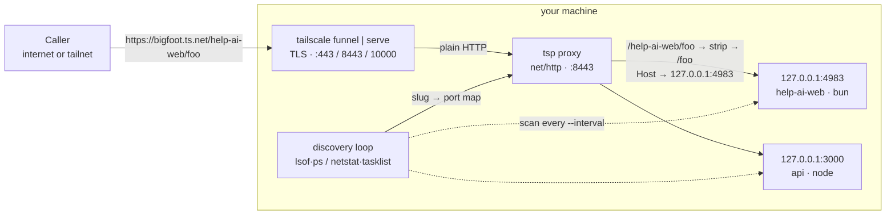
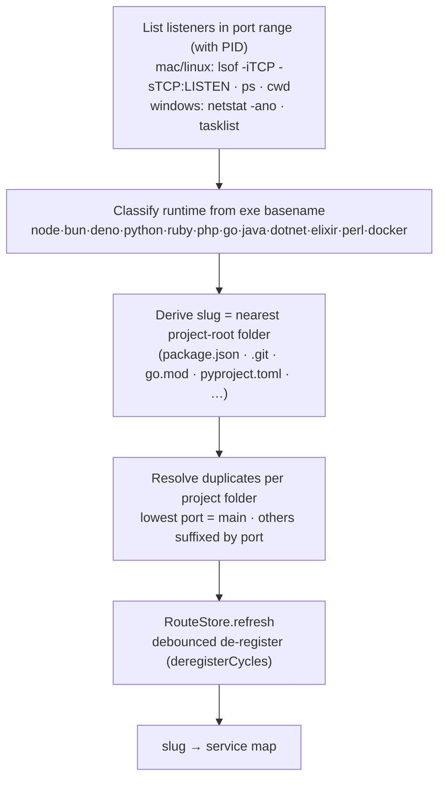
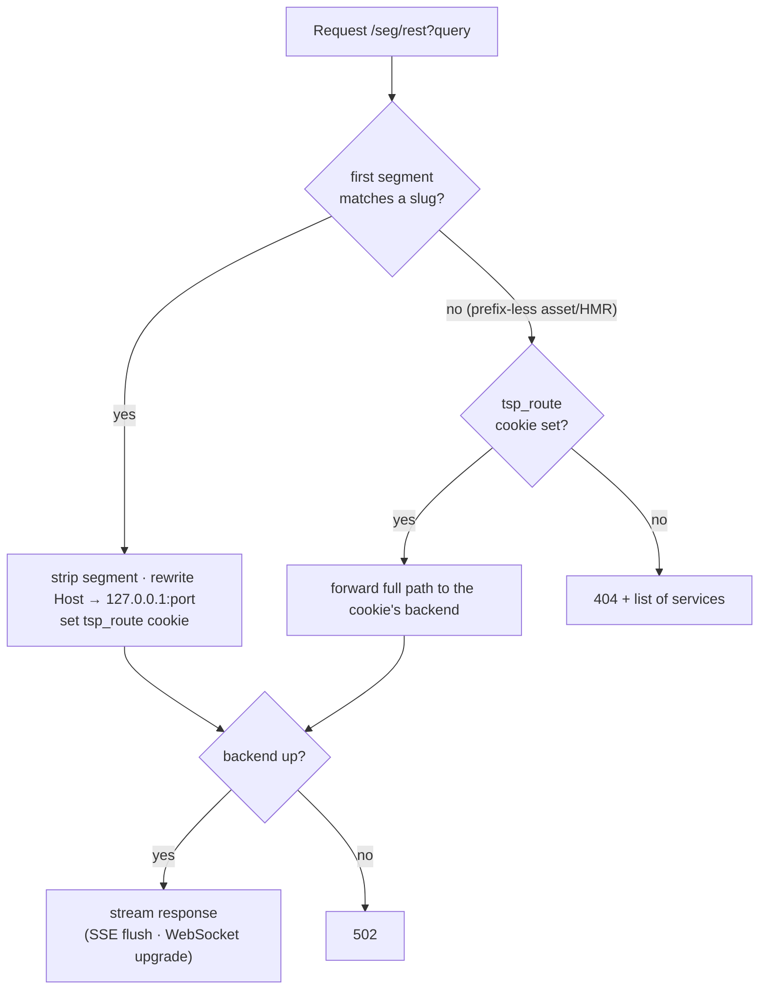
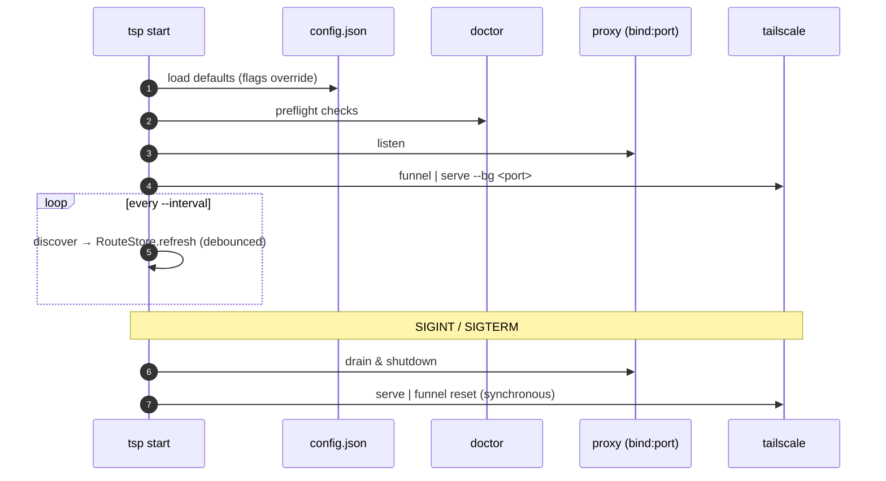

# How it works

`tsp` discovers local dev servers by port and serves them all behind one Tailscale
entry, routed by the first URL path segment (the project name).

## The problem it solves

[Tailscale Funnel](https://tailscale.com/kb/1223/funnel) and
[Serve](https://tailscale.com/kb/1312/serve) expose your node's single MagicDNS
name. Funnel has no wildcard subdomains and is limited to ports 443/8443/10000. So
to reach many local dev servers through one entry, you route by **path**.

`tsp` does that automatically, with no per-app config. It finds whatever is
listening, names each by its project folder, and proxies to it.

## Architecture

One Tailscale entry terminates TLS and forwards plain HTTP to the local `tsp`
proxy, which routes by the **first path segment** to the matching dev server. A
background loop keeps the slug→port map current.

## Discovery pipeline (every `--interval` seconds)

1. **List listeners** — sockets in `LISTEN` within the port range, with PID:
   - macOS/Linux: `lsof -nP -iTCP -sTCP:LISTEN -Fpcn`, enriched with `ps -o comm`
     (full runtime path) and `lsof -d cwd` (working directory).
   - Windows: `netstat -ano` + `tasklist` (no working directory available).
2. **Classify runtime** from the executable basename — known web runtimes are
   `node`, `bun`, `deno`, `python` (incl. `uvicorn`/`gunicorn`), `ruby` (incl.
   `puma`), `php` (incl. `php-fpm`), `go`, `java`, `dotnet`, `elixir`, `perl`, and
   Docker-published ports. **All known runtimes are kept by default**; `--all`
   includes every listener, and `--runtimes a,b` restricts to a chosen set.
3. **Slug** = the nearest project-root folder name walking up from the working
   directory (markers: `package.json`, `.git`, `go.mod`, `pyproject.toml`,
   `Cargo.toml`, `deno.json`, `composer.json`, `Gemfile`). No cwd → `<runtime>-<port>`.
4. **Resolve duplicates** — within one **project** (same project-root directory)
   the process on the **lowest port** becomes the main service under a clean,
   port-free slug; any other process in the same folder gets a `-<port>` suffix so
   it stays reachable. A single process listening on several ports collapses to its
   lowest port. All services are surfaced in the logs / `list` / `status`. Two
   *distinct* projects that happen to share a folder name also get a `-<port>`
   suffix to stay unique.

## Routing

For `/<segment>/<rest...>?<query>`:

- **Hit** → forward to `http://127.0.0.1:<port>/<rest...>?<query>` (segment stripped,
  `Host` rewritten — see header handling below). Streaming flushes immediately
  (`FlushInterval = -1`); WebSocket upgrades are relayed by the stdlib.
- **Miss / empty** → `404` with the list of registered services.
- **Dead backend** → `502`.

The proxy uses a single bounded `http.Transport` (capped idle pool + 60s idle
timeout) so connections to dev servers that come and go don't accumulate.

### Host / forwarded headers

This is a standard HTTP reverse proxy, so it uses the `X-Forwarded-*` headers
(like nginx/Caddy/Traefik) — **not** PROXY protocol, which dev servers don't
expect and which would corrupt them.

- The upstream `Host` is **always** the local target (`127.0.0.1:<port>`), so
  Host-validating dev servers accept the request.
- `X-Forwarded-For` (the real client IP) is always forwarded.
- **Default (local):** `X-Forwarded-Host`/`-Proto` are set to the local target
  (`http`). The app never sees the external host, so it builds URLs and redirects
  exactly as it would on `localhost` — no surprises.
- **`--forward-host` (proxy):** `X-Forwarded-Host` = the public funnel/serve host
  and `X-Forwarded-Proto: https`, so apps that need the public URL (OAuth
  callbacks, canonical links, sitemaps) get it. Enable per-run or in config
  (`"forwardHost": true`).

### Slug separators (`-` vs `_`)

Slugs are canonically **dash-separated** — `slugify` collapses every run of
non-`[a-z0-9]` characters to a single `-`, so a registered route never contains
an underscore. By default (`--match-separators`, on) the proxy folds `_` to `-`
when an exact segment lookup misses, so `/module_api_foo/` reaches the same
backend as `/module-api-foo/`. Set `--match-separators=false` (or
`"matchSeparators": false`) to route only the exact dash form.

### Cookie route-affinity (so apps render correctly)

Apps assume they live at the site root, so their HTML references absolute paths
(`/_next/static/...`, `/api/...`, the HMR WebSocket). Under path routing those
requests arrive *without* the `/<slug>/` prefix and would 404 — the page would
load with no CSS/JS.

To fix this, when a request matches `/<slug>/...` the proxy sets a `tsp_route`
cookie pinning the browser to that project. A subsequent **prefix-less** request
(no matching slug) is routed, full-path, to the cookie's backend. So after you
open `…/web/`, that tab's `/_next/...`, `/api/...`, and HMR requests all reach the
`web` dev server and the page renders exactly like `localhost`.

Caveat: affinity is per-browser, so actively using two different apps in the same
browser at once isn't supported — open them in separate browsers/profiles, or
visit each via its `/<slug>/` URL to switch.

## State, debounce, and lifecycle

- A `RouteStore` holds the current `slug → service` map, refreshed by a ticker.
- **De-register debounce:** a service missing from discovery is retained for
  `deregisterCycles` (default 5) consecutive scans before removal — so a dev-server
  restart doesn't drop its route. New services are logged on discovery; removals are
  logged after the debounce.
- On `SIGINT`/`SIGTERM` the server drains and `tailscale serve|funnel reset` runs
  synchronously before exit.

## Exposure modes

- **Public** (default) → `tailscale funnel --bg <proxy-port>` (ports 443/8443/10000).
- **Private** (`--private`) → `tailscale serve --bg <proxy-port>` (tailnet-only).

## Config & default command

`~/.tailscale-proxy/config.json` (written by `tsp configure`) provides the defaults;
CLI flags override them. Running `tsp` with no subcommand runs `start` with that
config — so once configured, a bare `tsp` is all you need.
