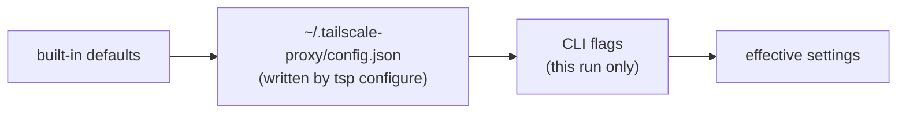

# Configuration

`tsp configure [flags]` writes `~/.tailscale-proxy/config.json` (created on first
use). Flags always override the config for a single run; the file is the source
of defaults, and a bare `tsp` runs `start` with it.

```bash
tsp configure --ports 3000-9000 --runtimes node,bun,python --private
tsp                       # uses the saved config
```

Settings resolve left-to-right — each layer overrides the one before it:



## File format

```json
{
  "ports": "3000-6000",
  "all": false,
  "runtimes": "",
  "private": false,
  "bind": "127.0.0.1",
  "port": 8443,
  "interval": 20,
  "httpsPort": 443,
  "logRequests": true,
  "deregisterCycles": 5,
  "forwardHost": false,
  "matchSeparators": true,
  "docker": false,
  "acceptDns": ""
}
```

| Key | Meaning |
| --- | --- |
| `ports` | Port range (`"3000-6000"`) or a single port (`"4000"`) to scan |
| `all` | Include every listener, not just known web runtimes |
| `runtimes` | Comma-separated allow-list, e.g. `"node,bun,python"` (empty = all known) |
| `private` | Expose via Tailscale Serve (tailnet-only) instead of Funnel |
| `bind` | Proxy listen address (`0.0.0.0` to reach it from containers/LAN) |
| `port` | Local proxy HTTP port |
| `interval` | Re-scan period, seconds |
| `httpsPort` | Public/tailnet HTTPS port (Funnel: 443 / 8443 / 10000) |
| `logRequests` | Log each proxied request |
| `deregisterCycles` | Consecutive missing scans before a service is removed |
| `forwardHost` | Forward the public host to apps (`X-Forwarded-Host`/`-Proto`) |
| `matchSeparators` | Treat `-` and `_` as interchangeable in the path slug, so `/module-api/` and `/module_api/` both route (default on) |
| `docker` | Also discover Docker containers via the local Docker API (read-only, over `/var/run/docker.sock`) |
| `acceptDns` | `""` leaves Tailscale DNS alone; `"true"`/`"false"` runs `tailscale set --accept-dns` on start |

## Host header behavior

By default `tsp` presents a **local** request to your app: `Host: localhost:<port>`,
the `/<slug>/` prefix stripped, and `X-Forwarded-For` preserved — so the app
behaves exactly like it does on `localhost` (CORS, cookies, host-allowlists all
match). Set `forwardHost: true` (or `--forward-host`) to surface the public host
via `X-Forwarded-Host` + `X-Forwarded-Proto: https` for apps that need the public
URL (OAuth callbacks, canonical links).

## Slug separators

Slugs are canonically dash-separated. With `matchSeparators` on (the default),
`tsp` folds `_` to `-` when an exact route lookup misses, so `/module_api_foo/`
and `/module-api-foo/` reach the same dev server. Set `matchSeparators: false`
(or `--match-separators=false`) to route only the exact dash form.
