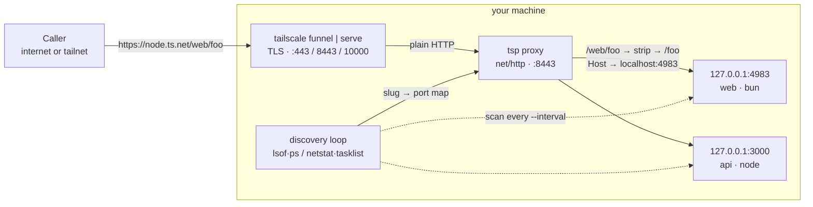
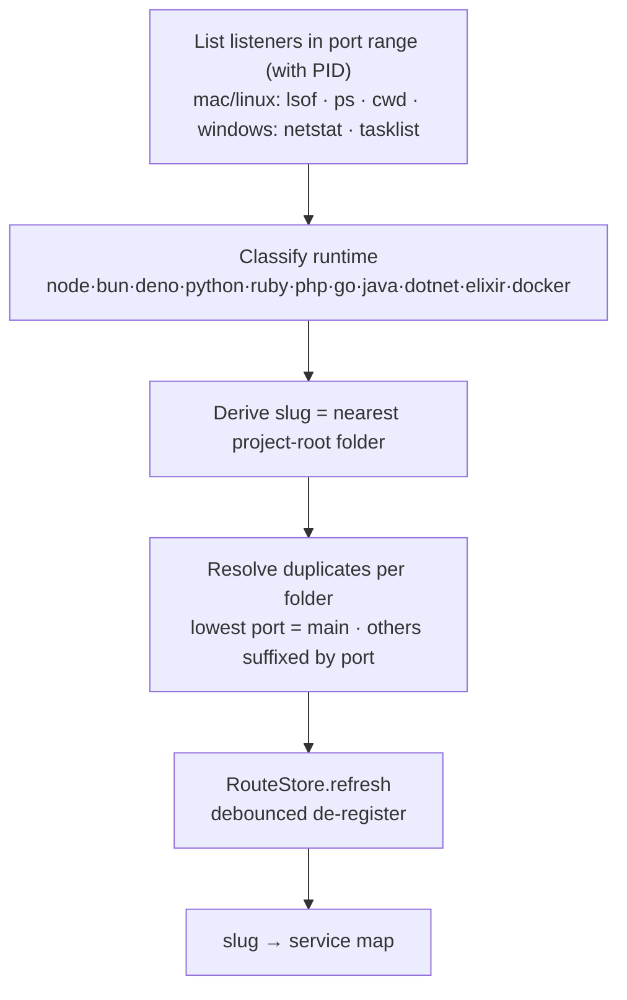
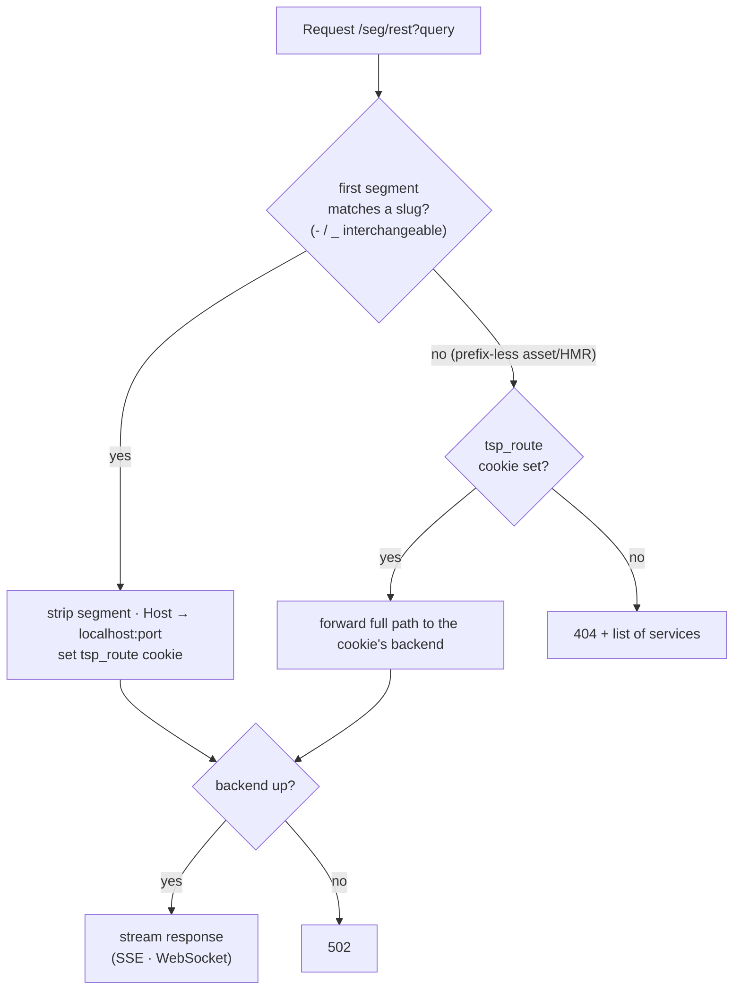
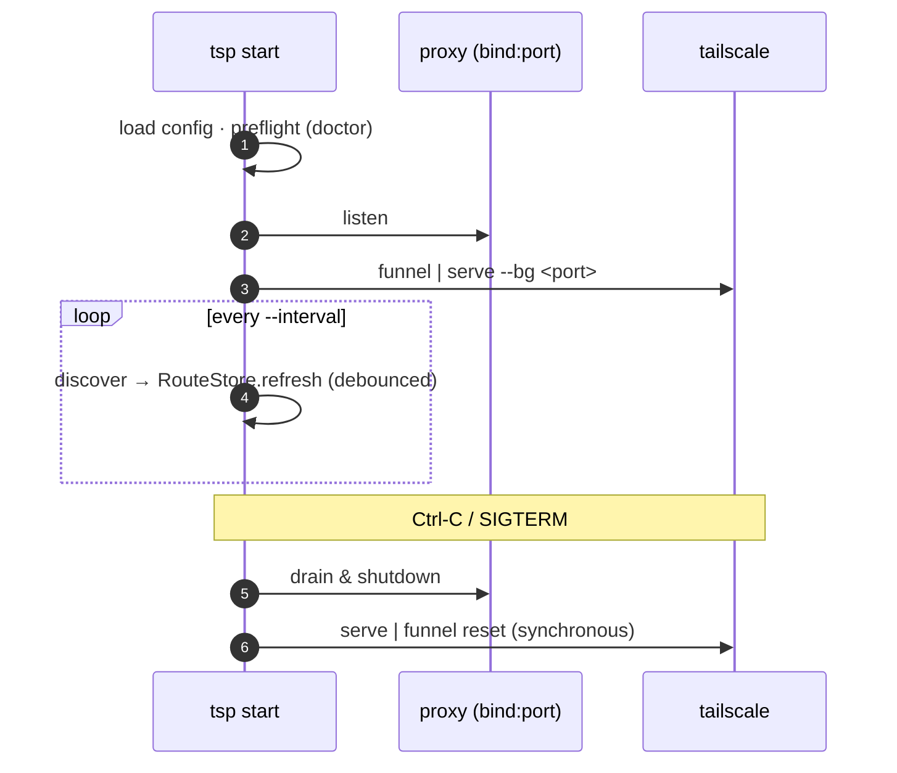

# How it works

`tsp` is a path-routing reverse proxy that sits between a single Tailscale entry
and your many local dev servers.

## Architecture

One Tailscale entry terminates TLS and forwards plain HTTP to the local `tsp`
proxy, which routes by the **first path segment** to the matching dev server.

## Discovery pipeline

Every `--interval` seconds:

1. **List listeners** — TCP sockets in `LISTEN` within the port range, with PID
   (macOS/Linux via `lsof`+`ps`, Windows via `netstat`+`tasklist`).
2. **Classify runtime** from the executable name (`node`, `bun`, `deno`,
   `python`/`uvicorn`/`gunicorn`, `ruby`/`puma`, `php`, `go run`, `java`,
   `dotnet`, `elixir`, `docker-proxy`, …).
3. **Slug** = the nearest project-root folder name (markers: `package.json`,
   `.git`, `go.mod`, `pyproject.toml`, `Cargo.toml`, `mix.exs`, …).
4. **Resolve duplicates** — within one project folder the process on the **lowest
   port** is the main service (clean, port-free slug); any other process in the same
   folder gets a `-<port>` suffix so it stays reachable. A single process on several
   ports collapses to its lowest port. Distinct projects sharing a folder name also
   get a `-<port>` suffix to stay unique.

## Routing

For `/<segment>/<rest…>?<query>`:

- **Hit** → forward to `http://127.0.0.1:<port>/<rest…>` (segment stripped, `Host`
  rewritten to `localhost`). Streaming flushes immediately; WebSocket upgrades are
  relayed.
- **Miss / empty** → `404` listing the registered services.
- **Dead backend** → `502`.

Slugs are canonically dash-separated. With `--match-separators` (on by default),
an exact miss is retried with `_` folded to `-`, so `/module_api_foo/` and
`/module-api-foo/` reach the same server. `--match-separators=false` routes only
the exact dash form.

### Cookie route-affinity

Apps assume they live at the root, so their HTML references absolute paths
(`/_next/...`, `/api/...`, HMR). When you open `…/<slug>/`, `tsp` sets a
`tsp_route` cookie pinning that browser tab to the project, so prefix-less requests
follow it to the right backend — and the page renders exactly like `localhost`.

## Lifecycle

- A `RouteStore` is refreshed on a ticker. A service missing from discovery is
  kept for `deregisterCycles` scans before removal (no flapping on restarts).
- On `Ctrl-C`, the server drains and `tailscale serve|funnel reset` runs before
  exit — never leaving a Funnel pointing at a dead port.
- A single bounded `http.Transport` keeps connections to dev servers from
  accumulating.
