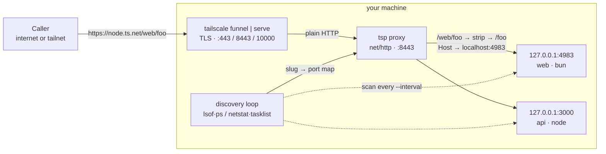

import { Callout } from "nextra/components";

# tailscale-proxy

An open-source, **self-hosted [ngrok](https://ngrok.com) alternative** built on
[Tailscale](https://tailscale.com): discover your local dev servers by **port**
and expose them through a **single Tailscale entry** — privately
([Serve](https://tailscale.com/kb/1312/serve), tailnet-only) or publicly
([Funnel](https://tailscale.com/kb/1223/funnel)) — routed by **project name**.

<Callout type="info">
  **Why not ngrok?** Your traffic runs over your own Tailscale tunnel on a stable
  `*.ts.net` URL — no third-party tunnel, no per-session random URLs, no request
  rate limits or paywalls. Share **many** dev servers through **one** hostname,
  and discovery is automatic — no `ngrok http 3000` per port.
</Callout>

No per-app wiring: just run your servers (`node`, `bun`, `deno`, `python`, `php`,
`ruby`, `go`, `java`, …) and `tsp` finds the ones listening in a port range,
derives a path slug from each project's folder, and routes to them under one
hostname:



`tsp` strips the first path segment (the project name) and forwards the rest to
that project's local port — so `…/web/foo` → `127.0.0.1:4983/foo`.

<Callout type="info">
  It re-scans every few seconds (so servers that come and go are picked up),
  keeps a service for a few scans before de-registering (no flapping on
  restarts), streams SSE, and proxies WebSocket upgrades. Zero runtime
  dependencies — one small Go binary.
</Callout>

## Try it in 30 seconds

```bash
# Start a couple of dev servers (each in its own project folder)
cd ~/sites/portfolio && npx serve -l 3000
cd ~/apps/web        && npx next dev -p 4000

# Share them through one Tailscale URL
npx tailscale-proxy doctor
npx tailscale-proxy
```

```
Services:
  https://bigfoot.tail-scale.ts.net/portfolio/  →  127.0.0.1:3000
  https://bigfoot.tail-scale.ts.net/web/        →  127.0.0.1:4000
```

## Why

- **One hostname, many apps.** Funnel only exposes a single hostname; `tsp` puts
  a path-routing proxy behind it so every dev server is reachable.
- **Zero config per app.** Run your server normally; `tsp` discovers it by port.
- **Looks like localhost.** The app receives `Host: localhost:<port>` (so CORS,
  cookies, and host-allowlists match) — with `--forward-host` when you need the
  public URL.
- **Private or public.** `--private` for tailnet-only Serve; Funnel by default.

Head to [Installation](/installation) or [Getting started](/getting-started).
