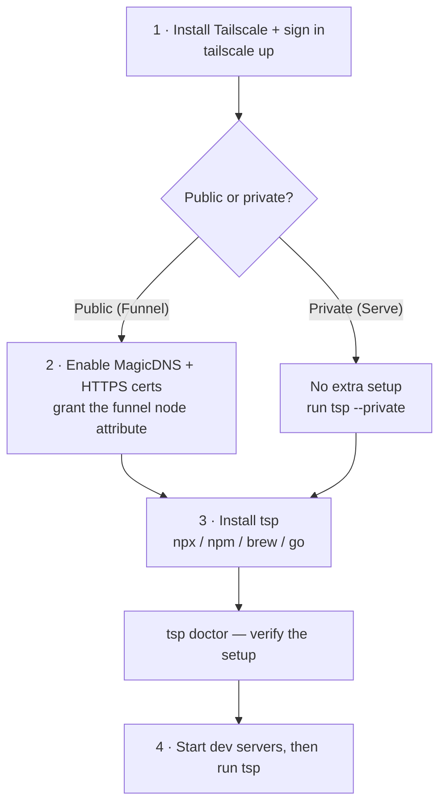

import { Callout, Tabs } from "nextra/components";

# Installation & setup

Get from zero to a public URL in **four steps**. Total time: ~5 minutes.



## 1. Install Tailscale & sign in

[Tailscale](https://tailscale.com) is the secure tunnel `tsp` runs on (the part
that replaces ngrok's relay). Install it, then bring your machine online:

<Tabs items={["macOS", "Linux", "Windows"]}>
  <Tabs.Tab>
    ```bash
    brew install --cask tailscale
    # or download the app: https://tailscale.com/download
    tailscale up          # opens a browser to sign up / log in (free)
    ```
  </Tabs.Tab>
  <Tabs.Tab>
    ```bash
    curl -fsSL https://tailscale.com/install.sh | sh
    sudo tailscale up     # opens a browser to sign up / log in (free)
    ```
  </Tabs.Tab>
  <Tabs.Tab>
    ```powershell
    winget install tailscale.tailscale
    tailscale up          # opens a browser to sign up / log in (free)
    ```
  </Tabs.Tab>
</Tabs>

## 2. Enable Funnel (for public URLs)

Funnel is what makes your dev server reachable from the **public internet**. Turn
it on once in the Tailscale admin console:

1. **Enable HTTPS certificates** → admin console → **DNS** → toggle on **MagicDNS**
   and **HTTPS Certificates** ([guide](https://tailscale.com/kb/1153/enabling-https)).
2. **Allow Funnel** → admin console → **Access controls** → add this to your
   policy file and save:
   ```jsonc
   {
     "nodeAttrs": [
       { "target": ["autogroup:member"], "attr": ["funnel"] }
     ]
   }
   ```
   ([Funnel docs](https://tailscale.com/kb/1223/funnel))

<Callout type="info">
  Only want it reachable from **your own devices** (your laptop, phone, teammates
  on the tailnet)? Skip this step and run `tsp --private` — that uses Tailscale
  **Serve** and needs no extra setup.
</Callout>

## 3. Install tsp

<Tabs items={["npx (no install)", "npm", "Homebrew", "Go"]}>
  <Tabs.Tab>
    ```bash
    npx tailscale-proxy doctor
    ```
  </Tabs.Tab>
  <Tabs.Tab>
    ```bash
    npm i -g tailscale-proxy
    tsp doctor
    ```
  </Tabs.Tab>
  <Tabs.Tab>
    ```bash
    brew install meabed/tap/tsp
    tsp doctor
    ```
  </Tabs.Tab>
  <Tabs.Tab>
    ```bash
    go install github.com/meabed/tailscale-proxy@latest
    tsp doctor
    ```
  </Tabs.Tab>
</Tabs>

`tsp doctor` confirms everything is wired up and prints the exact fix link for
anything missing:

```
✓ tailscale installed  (1.98.2)
✓ tailscale up
✓ funnel enabled
✓ service discovery  (2 service(s) in 3000-5000)
```

Supported: **macOS, Linux, Windows, WSL** (amd64 + arm64).

## 4. Run it

Start your dev servers as usual, then:

```bash
tsp                   # discover :3000-5000 and expose them publicly (Funnel)
```

```
Services:
  https://your-node.ts.net/web/  →  127.0.0.1:4000
  https://your-node.ts.net/api/  →  127.0.0.1:4100
```

Open those from anywhere. <kbd>Ctrl-C</kbd> stops it and resets the entry.
Next: the full [Getting started](/getting-started) walkthrough.

---

## Updating

```bash
tsp update            # self-updates, or prints the brew/npm command
```
