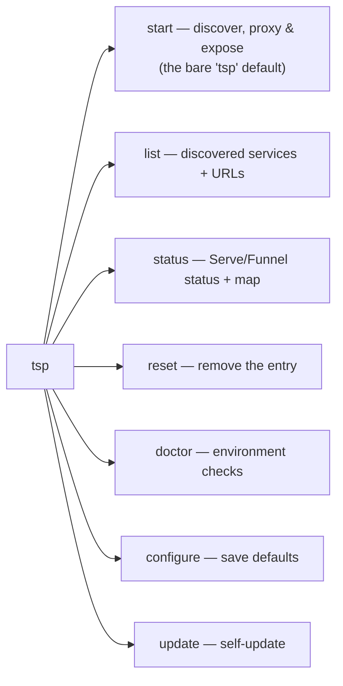

# Usage & commands

```
tsp [flags]         Default: run "start" with your saved config
tsp start           Discover services, run the proxy, and expose it
tsp status          Serve/Funnel status + the current service map
tsp list            Discovered services (slug → runtime, port, project, URL)
tsp reset           Remove the Serve/Funnel entry and exit
tsp doctor          Check tailscale, exposure readiness, and discovery
tsp configure       Save defaults to ~/.tailscale-proxy/config.json
tsp update          Update to the latest release
```



Run `tsp start --help` for all flags. Global: `-h/--help`, `-v/--version`.

## `start` flags

Defaults come from your config file (see [Configuration](/configuration)).

| Flag | Default | Meaning |
| --- | --- | --- |
| `--ports <lo-hi\|port>` | `3000-5000` | Port range **or a single port** to scan |
| `--all` | off | Include all listeners, not just web runtimes |
| `--runtimes <list>` | all known | Restrict to specific runtimes, e.g. `node,bun,python` |
| `--private` | off | Expose privately via Tailscale **Serve** (default: **Funnel**) |
| `--bind <addr>` | `127.0.0.1` | Listen address; `0.0.0.0` to reach from containers/LAN |
| `--port <n>` | `8443` | Local proxy HTTP port |
| `--interval <sec>` | `20` | Re-scan period |
| `--https-port <n>` | `443` | Public/tailnet HTTPS port (Funnel: `443`/`8443`/`10000`) |
| `--deregister-cycles <n>` | `5` | Missing scans before a gone service is removed |
| `--forward-host` | off | Forward the public host to apps via `X-Forwarded-Host/Proto` (default: local) |
| `--accept-dns <bool>` | unset | Optionally `tailscale set --accept-dns` on start; `false` lets a tailnet host resolve the public funnel name (persists) |
| `--bg` | off | Run detached (logs → `./tsp.log`) |
| `--proxy-only` | off | Run the proxy only; print the `tailscale` command |
| `--log-requests` | on | Log each proxied request |
| `--quiet` | off | Disable per-request logging |

## Startup output

On start, `tsp` prints the effective parameters and logs discoveries:

```
Using config: /Users/me/.tailscale-proxy/config.json
  ports=3000-5000  mode=public (Funnel)  proxy=127.0.0.1:8443  https=443
  interval=20s  runtimes=default (…)  deregister-after=5 scans  log-requests=true
  host=local (apps see localhost)

2026/05/31 02:05:48 discovered web   node   :4983  pid 15588  ~/work/help-ai/apps/web
2026/05/31 02:05:49 200 GET    /web/ → 127.0.0.1:4983 (6ms)
```

Request logs are colorized by status on a terminal (set `NO_COLOR` to disable).

## One-liners

```bash
tsp list                       # what's discoverable + the public URLs
tsp reset                      # take the Funnel down (tsp reset --private for Serve)
tsp --ports 4000               # scan a single port
tsp --interval 5               # faster pickup of new servers
tsp --proxy-only               # local proxy only; print the tailscale command
tsp --bg                       # run detached; logs → ./tsp.log
tsp --forward-host             # send the public host to apps
```
